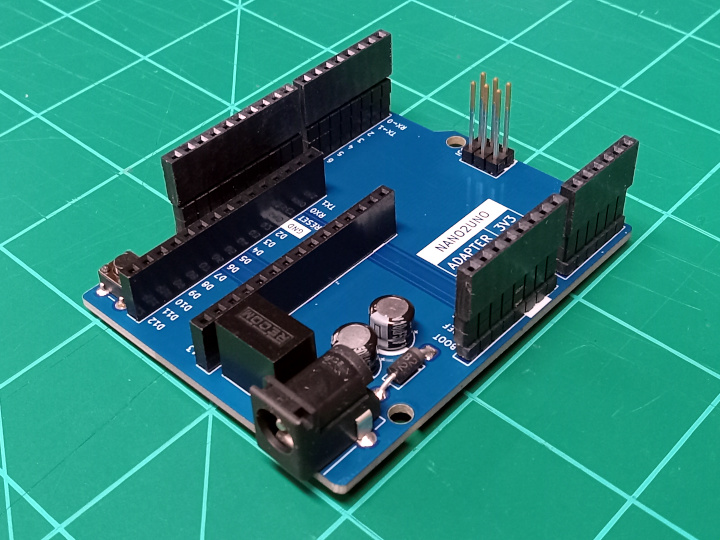

# Nano2UNO Adapter 3V3

The Nano2UNO Adapter 3V3 is a circuit board to adapt 3.3V Arduino Nano boards the the Arduino UNO form factor.

> [!NOTE]
> This document is distributed WITHOUT ANY EXPRESS OR IMPLIED WARRANTY, INCLUDING OF MERCHANTABILITY, SATISFACTORY QUALITY AND FITNESS FOR A PARTICULAR PURPOSE.

> [!NOTE]
> Pins A6 and A7 of the Arduino Nano are not connected because these pins are not present on the Arduino UNO interface.

> [!NOTE]
> The VCC pin on the ICSP header is connected to 5V.

> [!WARNING]
> Applying voltages higher than 3.3V to any I/O pin could damage any installed 3.3V Arduino Nano board.

### Compatibility
The Nano2UNO Adapter 3V3 should, in theory, be compatible with the following Arduino Nano boards:
- [Arduino Nano 33 IoT](https://store.arduino.cc/collections/boards-modules/products/arduino-nano-33-iot)
- [Arduino Nano 33 BLE](https://store.arduino.cc/collections/boards-modules/products/arduino-nano-33-ble)
- [Arduino Nano 33 BLE Sense](https://store.arduino.cc/collections/boards-modules/products/arduino-nano-33-ble-sense)
- [Arduino Nano 33 BLE Sense Rev2](https://store.arduino.cc/collections/boards-modules/products/nano-33-ble-sense-rev2)
- [Arduino Nano RP2040 Connect](https://store.arduino.cc/collections/boards-modules/products/arduino-nano-rp2040-connect)
- [Arduino Nano ESP32](https://store.arduino.cc/collections/boards-modules/products/nano-esp32)

### Documentation
- [Schematic](Nano2UNO-Adapter-3V3.pdf)
- [KiCAD Source Files](src)
- [STEP 3D Model](extras/Nano2UNO-Adapter-3V3.step)

## Fabrication

### Circuit Board
#### Specifications
- Board Length: __68.58mm__
- Board Width: __53.34mm__
- Board Thickness: __1.6mm__
- Substrate Material: __FR4__
- Copper Layers: __2__
- Copper Thickness: __1oz__
- Soldermask Color: __Any__ (Blue Suggested)
- Smallest Hole Diameter: __0.8mm__
- Smallest Trace Width: __0.2mm__ (7.8mil)
- Smallest Trace Spacing: __0.2mm__ (7.8mil)

#### Suppliers
Below are some circuit board suppliers I have used in the past:

- [OSH Park](https://oshpark.com/shared_projects/azt5S29A) is a US based circuit board fabrication service.
  They do have this design on file, so it is very easy to order this board from them by clicking on the link above.
  This supplier only provides the bare circuit board. They do not provide the complete circuit board assembly.

- [Seeed Studio Fusion](https://www.seeedstudio.com/fusion_pcb.html) makes circuit boards in China.
  They do not currently have this design on file, so to order from them, you will need to upload the [gerber and drill files](https://github.com/CMB27/Nano2UNO-Adapter-3V3/tree/main/gerbers) in a .zip folder.
  They have a lot of options when ordering; please refer to the [specifications](#specifications) above when making your choices.
  They do have a circuit board assembly service as well, but I am not especially familiar with it.

### Purchase Components
#### Bill of Materials

| References | Quantity | Manufacturer | Part Number    | Description                     | Notes                                                                                  |
|------------|---------:|--------------|----------------|---------------------------------|----------------------------------------------------------------------------------------|
| C1, C2     |        2 | Panasonic    | ECE-A1HKS100   | 10uF X7R Through-Hole Capacitor | These are use as decoupling capacitors for the 5V DC DC converter.                     |
| D1         |        1 | Vishay       | SB260S-E3/54   | DO-41 Diode                     | This provides reverse voltage protection on the VIN pin and barrel jack.               |
| J1, J3     |        2 | Samtec       | ESW-108-33-L-S | 1x8 Socket Header               | These are extended socket headers that make up part of the Arduino UNO interface.      |
| J2         |        1 | Samtec       | ESW-110-33-L-S | 1x10 Socket Header              | This is an extended socket header that makes up part of the Arduino UNO interface.     |
| J4         |        1 | Samtec       | ESW-106-33-L-S | 1x6 Socket Header               | This is an extended socket header that makes up part of the Arduino UNO interface.     |
| J5, J6     |        2 | Sullins      | PPPC151LFBN-RC	| 1x15 Socket Header              | These are typical, 8.5mm tall, socket headers that make up the Arduino Nano interface. |
| J7         |        1 | TSW/Samtec   | TSW-103-15-L-D | 2x3 Pin Header                  | This is an extended pin header that makes up part of the Arduino UNO interface.        |
| J8         |        1 | CUI          | PJ-102A        | 2.0mm ID, 5.5mm OD Barrel Jack  | This is a pretty common barrel jack.                                                   |
| SW1        |        1 | TE           | 1825910-6      | 6mm Pushbutton Switch           | This is a generic 6mm pushbutton switch.                                               |
| U1         |        1 | RECOM        | R-78K5.0-0.5   | 5V DC DC Converter              | This DC DC converter has an input voltage range of 6.5 - 36V.                          |

#### Suppliers
Below are some electronics suppliers I have used in the past:

- [Digi-Key](https://www.digikey.com/) is my usual go-to supplier for electronic components.
  Their website makes it pretty easy to sort through parts.

- [Mouser](https://www.mouser.com/) is very similar to Digi-Key in a lot of ways.
  They sometimes have better pricing, and they have excellent customer support.

- [Newark](https://www.newark.com/) tends to have a bit different selection than Digi-Key and Mouser, especially in the area of connectors.

- [Octopart](https://octopart.com/) is not a supplier per se; it is essenitally an electronic component search engine.
  This can be a very helpful tool when looking for parts, especially somewhat unusual ones, like extended socket headers.

All of these suppliers have a feature on their repecive websites where you can upload a spreadsheet file, such as [Nano2UNO-Adapter-3V3-BOM.csv](Nano2UNO-Adapter-3V3-BOM.csv), to populate the cart or find parts.

Last I checked, it is not possible to order all the components needed to build a Nano2UNO Adapter 3V3 from just one of these suppliers. Multiple orders will be needed.

### Assembly

#### Tools and Supplies
If you are assembling the Nano2UNO Adapter 3V3 yourself, you will need the following tools and supplies:
- A Good Quality Soldering Iron (A poor quality soldering iron will give you a bad day and make you hate soldering.)
- Flush Cutters (To trim long component leads)
- Flux Core Solder (Leaded solder is easier to work with, but lead-free solder is better for the environment.)
- Flux (Optional, but nice)
- Solder Sucker and Solder Wick (Optional, but they can save your bacon if you make a mistake)
- Isopropyl Alcohol (To clean off flux; not needed if using no-clean flux)
- Dish Soap (To clean off flux residue; not needed if using no-clean flux)

#### Assembly Steps
All the components are through hole soldered.
All components are placed on the front side of the board and solderd on the back side of the board.
These steps go through soldering each component, starting with the shortest.

1. D1 (Diode)
   - Bend the diode leads so that the part will fit in the footprint.
   - Place the diode, ensuring that the side with the line closest to it (the cathode) is facing the squarish pad.
   - Bend the diode leads on the backside of the board to ensure the diode remains in place when soldering.
   - Solder the leads to the pads.
   - Trim the leads using flush cutters.

2. SW1 (Pushbutton Switch)
   - Place the switch; it should stay in place.
   - Solder the leads to the board.

3. C1 and C2 (Capacitors)
   - Place the capacitors, ensuring that the `-` symbol on the capacitors is facing away from the `+` symbols on the board.
     For the capacitors the, the positive lead goes through the squarish pad and the negative lead goes through the circular pad.
   - Bend the capacitor leads on the backside of the board to ensure the capacitors stay in place.
   - Solder the capacitor leads.
   - Trim the leads.

4. J5 and J6 (Arduino Nano Socket)
   - If you have an Arduino Nano board, place the socket headers on the Nano's pins, then place the socket header pins through the holes on the Nano2UNO circuit board.
     This will ensure your Nano board will line up with the sockets once they are soldered in place.
     If you do not have an Arduino Nano board on hand, place the socket header pins as precisely as you can.
   - Carefully flip the board over the board, holding the socket headers in place.
     This can be difficult; it may be necessary to solder each socket header one at a time.
   - Tack solder the end pins of the socket headers.
   - Check that the socket headers are straight and seated correctly.
     If necessary remelt the solder joints to adjust the socket headers. (This is where flux can be nice.)
   - Once the headers are straight, solder the remaining pins. I usually go every other pin to avoid heat build up, then go back soldering the pins I skipped.
   - If you used an Arduino Nano board to place the sockets, remove it now.

5. U1 (DC DC Converter)
   - Place the DC DC converter module.
   - Tack solder one pin. I like to solder the middle pin.
   - Check that the component is straight and seated correctly.
     Remelt the tack joint to make corrections if necessary.
   - Solder the remaining two pins.

6. J8 (Barrel Jack)
   - Place the barrel Jack.
   - Tack solder the pin near the middle of the component.
   - Check that the part is straight and seated correctly.
   - Solder the remaining pins.

7. J7 (ICSP Header)
   - Place the pin header.
   - Tack solder one pin. I like to solder one of the corners.
     Be careful when soldering this component; it has a lot of exposed metal that can burn you when heated by a soldering iron.
   - Check that the part is straight and seated correctly.
   - Solder the remaining pins.

8. J1, J2, J3, and J4 (Arduino UNO Interface)
   - If you have a shield for the Arduino UNO, place the socket headers on its pins, then place the socket header pins through the holes on the Nano2UNO circuit board.
     This will make it easier and faster to install the sockets.
     If you don't have a shield you will likely need to install the sockets one at a time.
   - Carefully flip the board over the board, holding the socket headers in place.
   - Tack solder the end pins of the socket headers.
   - Check that the socket headers are straight and seated correctly.
   - Once the headers are straight, solder the remaining pins.
   - If you used a shield, remove it now.

9. Clean the flux off board  
   If all the flux you used to assemble the board, including the flux in the solder, is of the no-clean variety you can skip this step.  
   I usually use water soluble flux. If you use a different kind of flux, the following methods may not work.
   - Use isopropyl alcohol with a toothbrush to remove the bulk of the flux.
   - Clean the board with dish soap and warm water using the same toothbrush.
   - Dry the board thoroughly. I like to use compressed air for this step.

