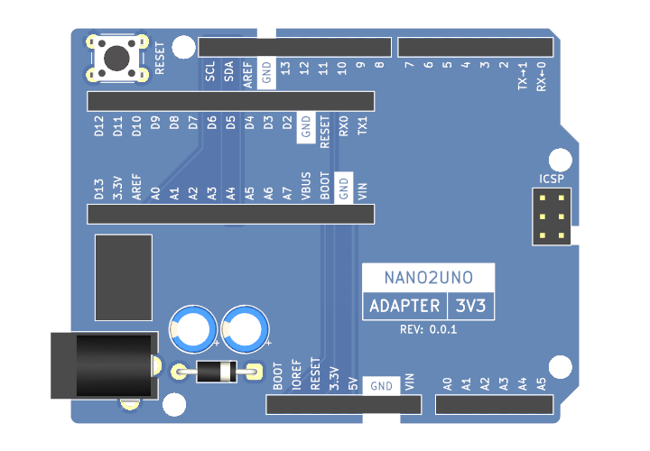

# Nano2UNO Adapter 3V3

The Nano2UNO Adapter 3V3 is a circuit board to adapt 3.3V Arduino Nano boards the the Arduino UNO form factor.

> [!NOTE]
> Pins A6 and A7 of the Arduino Nano are not connected because these pins are not present on the Arduino UNO interface.

> [!WARNING]
> Applying voltages higher than 3.3V to any I/O pin could damage any installed 3.3V Arduino Nano board.

### Compatibility
The Nano2UNO Adapter 3V3 should, in theory, be compatible with the following Arduino Nano boards:
- [Arduino Nano 33 IoT](https://store.arduino.cc/collections/boards-modules/products/arduino-nano-33-iot)
- [Arduino Nano 33 BLE](https://store.arduino.cc/collections/boards-modules/products/arduino-nano-33-ble)
- [Arduino Nano 33 BLE Sense](https://store.arduino.cc/collections/boards-modules/products/arduino-nano-33-ble-sense)
- [Arduino Nano 33 BLE Sense Rev2](https://store.arduino.cc/collections/boards-modules/products/nano-33-ble-sense-rev2)
- [Arduino Nano RP2040 Connect](https://store.arduino.cc/collections/boards-modules/products/arduino-nano-rp2040-connect)
- [Arduino Nano ESP32](https://store.arduino.cc/collections/boards-modules/products/nano-esp32)

### Documentation
- [Schematic](Nano2UNO-Adapter-3V3.pdf)
- [KiCAD Source Files](src)

## Fabrication

### Circuit Board
#### Specifications
- Board Length: __68.58mm__
- Board Width: __53.34mm__
- Board Thickness: __1.6mm__
- Substrate Material: __FR4__
- Copper Layers: __2__
- Copper Thickness: __1oz__
- Soldermask Color: __Any__ (Blue Suggested)
- Smallest Hole Diameter: __0.8mm__
- Smallest Trace Width: __0.2mm__ (7.8mil)
- Smallest Trace Spacing: __0.2mm__ (7.8mil)

#### Suppliers
Below are some circuit board suppliers I have used in the past:

- [OSH Park](https://oshpark.com/shared_projects/azt5S29A)  
This is a US based circuit board fabrication service.
They do have this design on file, so it is very easy to order this board from them by clicking on the link above.
This supplier only provides the bare circuit board. They do not provide the complete circuit board assembly.

- [Seeed Studio Fusion](https://www.seeedstudio.com/fusion_pcb.html)  
This supplier makes the boards in China.
They do not currently have this design on file, so to order from them, you will need to upload the [gerber and drill files](https://github.com/CMB27/Nano2UNO-Adapter-3V3/tree/main/gerbers) in a .zip folder.
They have a lot of options when ordering; please refer to the [specifications](#specifications) above when making your choices.
They do have a circuit board assembly service as well, but I am not especially familiar with it.

### Purchase Components
#### Bill of Materials

| References | Quantity | Manufacturer | Part Number    | Description                     | Notes                                                                                  |
|------------|---------:|--------------|----------------|---------------------------------|----------------------------------------------------------------------------------------|
| C1, C2     |        2 | Panasonic    | ECEA1HKS100    | 10uF X7R Through-Hole Capacitor | These are use as decoupling capacitors for the 5V DC DC converter.                     |
| D1         |        1 | Vishay       | SB260S-E3/54   | DO-41 Diode                     | This provides reverse voltage protection on the VIN pin and barrel jack.               |
| J1, J3     |        2 | Samtec       | ESW-108-33-L-S | 1x8 Socket Header               | These are extended socket headers that make up part of the Arduino UNO interface.      |
| J2         |        1 | Samtec       | ESW-110-33-L-S | 1x10 Socket Header              | This is an extended socket header that makes up part of the Arduino UNO interface.     |
| J4         |        1 | Samtec       | ESW-106-33-L-S | 1x6 Socket Header               | This is an extended socket header that makes up part of the Arduino UNO interface.     |
| J5, J6     |        2 | Sullins      | PPPC151LFBN-RC	| 1x15 Socket Header              | These are typical, 8.5mm tall, socket headers that make up the Arduino Nano interface. |
| J7         |        1 | TSW/Samtec   | TSW-103-15-L-D | 2x3 Pin Header                  | This is an extended pin header that makes up part of the Arduino UNO interface.        |
| J8         |        1 | CUI          | PJ-102A        | 2.0mm ID, 5.5mm OD Barrel Jack  | This is a pretty common barrel jack.                                                   |
| SW1        |        1 | TE           | 1825910-6      | 6mm Pushbutton Switch           | This is a generic 6mm pushbutton switch.                                               |
| U1         |        1 | RECOM        | R-78K5.0-0.5   | 5V DC DC Converter              | This DC DC converter has an input voltage range of 6.5 - 36V.                          |

#### Suppliers
Below are some electronics suppliers I have used in the past:

- [Digi-Key](https://www.digikey.com/)  
Digi-Key is my usual go-to supplier for electronic components.
Their website makes it pretty easy to sort through parts.

- [Mouser](https://www.mouser.com/)  
Mouser is very similar to Digi-Key in a lot of ways.
They sometimes have better pricing, and they have excellent customer support.

- [Newark](https://www.newark.com/)  
Newark tends to have a bit different selection than Digi-Key and Mouser, especially in the area of connectors.

- [Octopart](https://octopart.com/)  
Octopart is not a supplier per se; it is essenitally an electronic component search engine.
This can be a very helpful tool when looking for parts, especially somewhat unusual ones, like extended socket headers.

All of these suppliers do have a feature on their repecive websites where you can upload a spreadsheet file, such as [Nano2UNO-Adapter-3V3-BOM.csv](Nano2UNO-Adapter-3V3-BOM.csv), to populate the cart or find parts.

Last I checked, it is not possible to order all the components needed to build a Nano2UNO Adapter 3V3 from just one of these suppliers. Multiple orders will be needed.

### Assembly

All of the components are through hole soldered.
